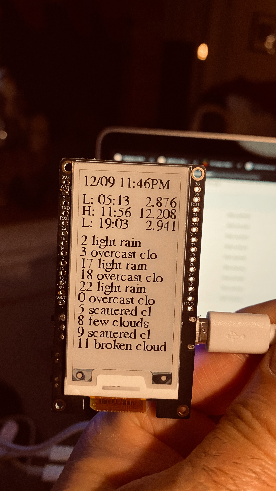

# Weather and Tides smart display

This is a smart display with a TTGO T5 e-paper board with a TPL510 timer that pulls in data for tides and weather reports.

I am not happy with the code design, I wish I could write this in C#. Sigh!